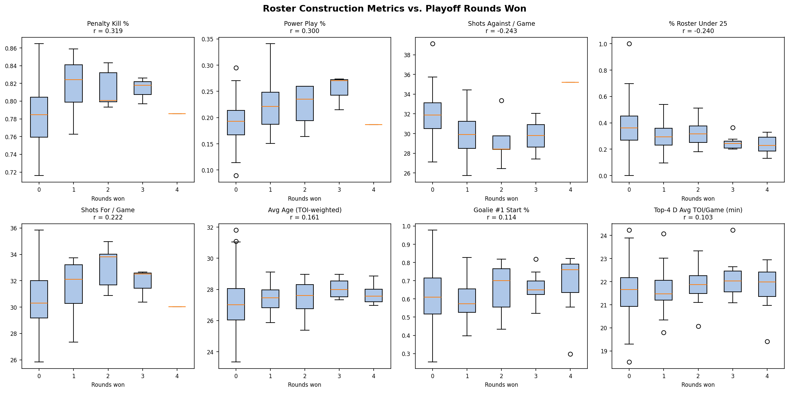

# NHL Roster Construction & Cap Analysis

Which roster construction decisions correlate most with winning in the NHL playoffs?

This project pulls data from the NHL Stats API across 7 seasons (2017–18 through 2023–24) to build per-team composition profiles — age distribution, scoring concentration, ice time usage, goalie deployment, and special teams — then correlates each metric with playoff depth and Cup wins.

Salary cap data hooks are built into the schema and will be populated when a data source becomes available, enabling a second layer of analysis around cap allocation strategy.

---

## Key Findings



### Roster Construction

**Special teams are the strongest predictor of playoff success.** Penalty kill % (r = 0.32) and power play % (r = 0.30) are the two most correlated metrics with playoff rounds won — both statistically significant (p < 0.01). Teams that go deep in the playoffs are consistently better at both special teams phases.

**Youth is negatively correlated with Cup wins.** The % of the roster under 25 has an r = -0.24 with rounds won. Cup winners average only 23.4% of their roster GP from players under 25, compared to 34.9% for the rest of the league. This suggests that championship teams are built on experienced, proven players rather than young, developing ones.

**Older rosters win more.** TOI-weighted average age shows a positive correlation (r = 0.16) with playoff success. Cup winners averaged 27.7 years (TOI-weighted) vs. 27.2 for the field — a modest but consistent gap.

**Scoring concentration doesn't matter much.** Whether a team's points are heavily concentrated in one star player or spread across the lineup (measured by Gini coefficient and top-N share) shows essentially no correlation with playoff success. Stars vs. committees doesn't appear to be the differentiator.

### Salary Cap Strategy

**Spending more helps, but modestly.** Total cap spend has a weak positive correlation with playoff success (r = 0.14, p = 0.04). Cup winners averaged ~$5.4M more in total cap commitments than the rest of the league — a real signal, but far weaker than special teams.

**Pay your goalie.** The strongest cap allocation signal is goalie spending. Cup winners directed 10.6% of their cap to goalies vs. 9.3% for the field (r = 0.17, p = 0.01). This aligns with the finding that goalie save percentage is one of the more stable predictors of playoff depth.

**Stars vs. committees: doesn't matter.** Cap concentration metrics — Gini coefficient, top-1 share, top-3 share — show no statistically significant relationship with playoff success. Concentrating cap on one or two superstar contracts vs. distributing it evenly has no measurable effect on playoff depth.

**Forward vs. defence split: also doesn't matter.** How teams divide spending between forwards and defencemen is uncorrelated with playoff outcomes. You can build a championship team with almost any cap philosophy, as long as your special teams and goaltending hold up.

---

## Results

| Metric | r | p | Cup Winner Avg | Field Avg |
|---|---|---|---|---|
| **Penalty Kill %** | **0.319** | 0.001 | 78.6% | 79.1% |
| **Power Play %** | **0.300** | 0.001 | 18.6% | 20.0% |
| Shots Against / Game | -0.243 | 0.009 | 35.2 | 31.4 |
| **% Roster Under 25** | **-0.240** | <0.001 | 23.4% | 34.9% |
| Shots For / Game | 0.222 | 0.017 | 30.0 | 30.8 |
| *Cap — Goalie %* | *0.168* | *0.013* | *10.6%* | *9.3%* |
| Avg Age (TOI-weighted) | 0.161 | 0.017 | 27.7 | 27.2 |
| *Total Cap Spend* | *0.140* | *0.039* | *$85.7M* | *$80.3M* |
| Goalie #1 Start % | 0.114 | 0.092 | 67.7% | 61.8% |
| Cap Gini | 0.109 | 0.107 | 0.479 | 0.452 |
| Top-4 D Avg TOI/Game | 0.103 | 0.127 | 21.7 min | 21.6 min |
| TOI Gini | -0.058 | 0.389 | 0.406 | 0.408 |
| Points — Top 1 Share | -0.056 | 0.409 | 11.3% | 12.2% |
| Cap — Top 1 Share | -0.013 | 0.845 | 11.0% | 10.9% |

*r = Pearson correlation with playoff rounds won. Bold = p < 0.01. Italic = cap metrics (p < 0.05).*

---

## Salary Cap Hooks

The `team_profiles.csv` dataset includes the following columns, currently null, ready to populate when cap data becomes available:

| Column | Description |
|---|---|
| `cap_hit_total` | Total team cap spend |
| `cap_pct_ceiling` | Cap spend as % of league ceiling |
| `cap_top1_share` | Highest-paid player's % of total cap |
| `cap_top3_share` | Top 3 players' % of total cap |
| `cap_gini` | Gini coefficient of cap distribution |
| `cap_fwd_pct` | % of cap allocated to forwards |
| `cap_def_pct` | % of cap allocated to defensemen |
| `cap_goalie_pct` | % of cap allocated to goalies |

---

## How to Run

```bash
python -m venv .venv
source .venv/Scripts/activate   # Windows
pip install -r requirements.txt

python scripts/fetch_data.py          # fetch rosters + stats from NHL API
python scripts/build_team_profiles.py # build per-team composition metrics
python scripts/build_outcomes.py      # pull playoff outcomes from nhl-playoff-predictor
python scripts/fetch_cap_data.py      # scrape player cap data from capwages.com (~15 min, cached)
python scripts/populate_cap_data.py   # fill cap columns in team_profiles.csv
python scripts/analysis.py            # correlate all metrics with outcomes + save chart
```

> **Note:** `build_outcomes.py` expects the [nhl-playoff-predictor](https://github.com/thetylerb/nhl-playoff-predictor) repo to be in a sibling directory (`../nhl_data/`).
>
> `fetch_cap_data.py` fetches ~1,700 player pages from capwages.com and caches them to `data/raw/`. The first run takes ~15 minutes; subsequent runs are instant.

---

## Project Structure

```
nhl_cap_analysis/
├── data/
│   ├── raw/               # Cached API + capwages responses (gitignored)
│   └── processed/
│       ├── team_profiles.csv   # One row per team per season (cap columns populated)
│       ├── outcomes.csv        # Playoff results joined from sibling project
│       └── metric_results.csv  # Correlation results table
├── notebooks/
│   └── 01_cap_analysis.ipynb   # Cap analysis walkthrough with charts
├── outputs/
│   └── metric_leaderboard.png  # Box plot grid: top metrics vs. rounds won
├── scripts/
│   ├── fetch_data.py           # NHL API data fetching (rosters, stats)
│   ├── build_team_profiles.py  # Aggregate metrics per team per season
│   ├── build_outcomes.py       # Pull playoff outcomes
│   ├── fetch_cap_data.py       # Scrape player cap data from capwages.com
│   ├── populate_cap_data.py    # Fill cap columns in team_profiles.csv
│   └── analysis.py             # Correlation analysis + chart generation
└── requirements.txt
```

---

## Data Source

All performance data fetched from the public [NHL Stats API](https://api.nhle.com/stats/rest/en) and [NHL Web API](https://api-web.nhle.com/v1). No API key required.
